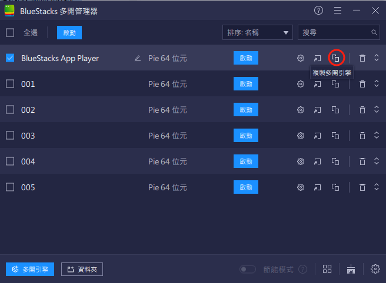
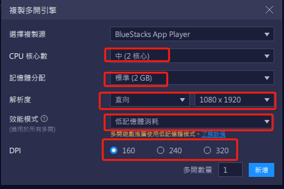
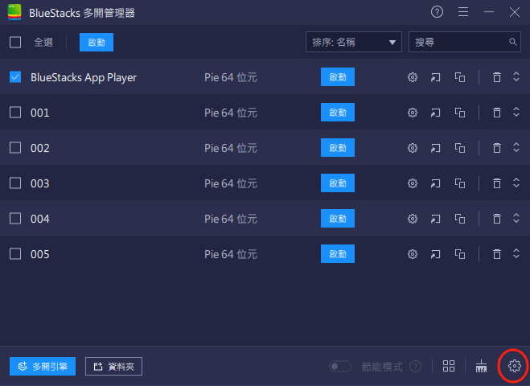
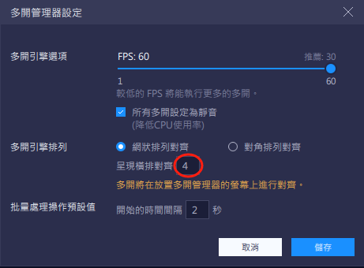
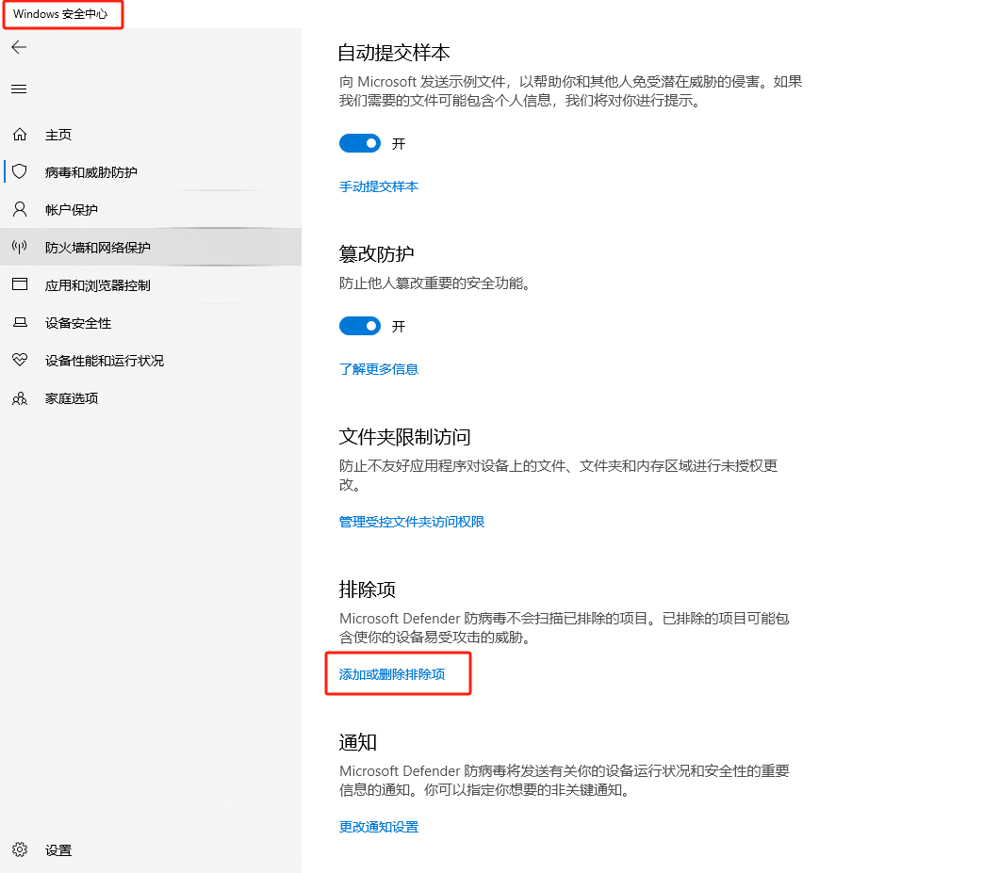

# PHA_dm

# Pixel Hero 游戏脚本

本项目为 **Pixel Hero** 的自动化游戏脚本，专为 **BlueStacks 模拟器** 环境设计，旨在简化玩家日常操作，提高游戏效率。

## 模拟器设置

1. 下载 BlueStacks 模拟器：[官方链接](https://www.bluestacks.com)
2. 下载OCR识别文字的工具：通过网盘分享的文件：OCR.zip
链接: https://pan.baidu.com/s/1dFuj-XIaEMsubN-d6EIYQg?pwd=9999 提取码: 9999
3. 模拟器窗口命名： 改名为 `001`, `002`, `003` 序号，作为 window_id 。
4. 模拟器多开管理器设置**： 
   - **新建模拟器窗口设置**：
     - CPU核心数和内存选 **中等和标准**。
     - 模拟器分辨率选择 **竖直模式**（1080x1920）。
     - DPI 设置为 **160**。
     - 
     - 
   - **设置每个窗口大小尺寸，方便脚本识图**：
     - 本机如果是2560x1440 屏幕：一排排列 4 个窗口。
     - 本机如果是1920x1080 屏幕：一排排列 3 个窗口。
     - 
     - 
5. 

## 环境配置

1. 安装项目所需依赖：
   pip install -r requirements.txt
  
2. 将根目录下的 `env_example` 文件重命名为 `.env`。.env中的参数为窗口序号,循环时间和地图信息等。
   比如"003": {"BlueStacks": "Pie64_3", "map": 45, "afk": "稀有", "dungeon": "布鲁内地牢", "is_new": true},
   "BlueStacks": "Pie64_3"  表示3号窗口，
   "map": 45  表示刷第4个地图，第5关卡， 
   "afk": "稀有"  表示AFK模式自动拆解稀有装备，
   "dungeon": "布鲁内地牢"  表示团队地牢打布鲁内地牢，
   "is_new": true  表示该窗口是新号

3. python解释器要下载和选用32位的python，因为大漠插件只支持32位

---

## 项目结构说明

- **dm文件夹`**：
  - 大漠插件及其注册文件，提供模拟器操作支持。
  - 要确保在杀毒软件中添加了排除项，不查杀这两个插件所在的文件夹
  - 
  - 
- **OCR 文件夹**：
  - 包含文字识别软件，运行脚本首先启动 `OCR.exe` 文件以建立本地服务器，随时监听脚本中的截图文字识别请求。
  
- **主要代码文件**：
  - `libs/game.py`：核心游戏逻辑。
  - `libs/task.py`：处理日常任务。
  - `libs/new.py`：处理新手指导任务。
  - `libs/schedule.py`：任务调度与自动化管理。
  - `libs/tool.py`：绑定窗口、点击、识图等工具。
  - `PHA.py`：多进程操作模拟器窗口的脚本文件，24小时运行这个脚本。
- **测试文件夹**：
  - `test/` 中为临时测试脚本，不用于实际运行。

---

## 脚本功能逻辑

### 日常循环操作
- 每隔数分钟自动执行：
  - 检查是否掉线。
  - 处理新手任务。
  - 拆解装备获取经验，并将装备加入图鉴以提升战斗力。
  - 点击升级
  - 其它

### 定时任务
- 每 2、5、12、24或48 小时自动运行：
  - 领取免费钻石。
  - 领取邮件奖励。
  - 领取任务奖励。
  - 放置 **Toyz** 侦查以获取奖励。
  - 罗马竞技场和清理地下城。
  - 理论上还可以结合A星寻路刷野外boss。
  - 其它
  

---

## 注意事项

1. BlueStacks窗口的高度尽量保证有1080p，以确保视图准确。
2. 启动脚本时，确保 `OCR.exe`打开成功，否则文字识别功能将无法工作。
3. 新建游戏账号登录后，语言要设置为简体中文（方便文字识别），游戏内更改一次昵称（以免脚本做到这个新手任务的时候会卡住）。
